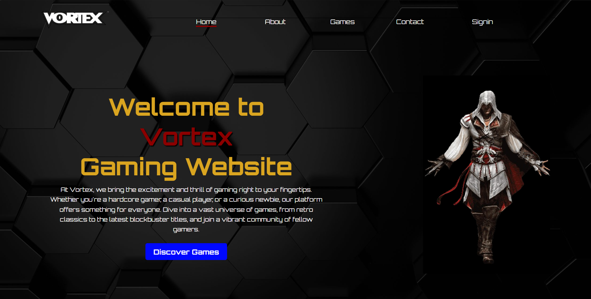
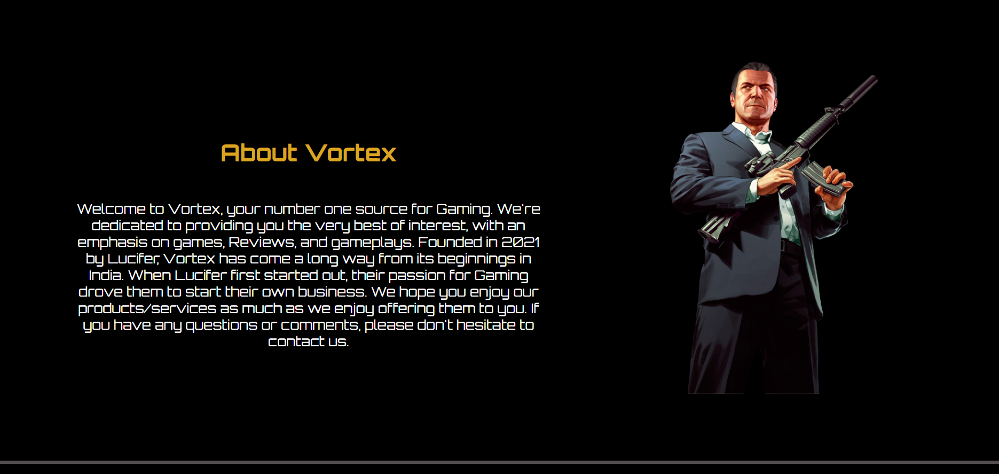
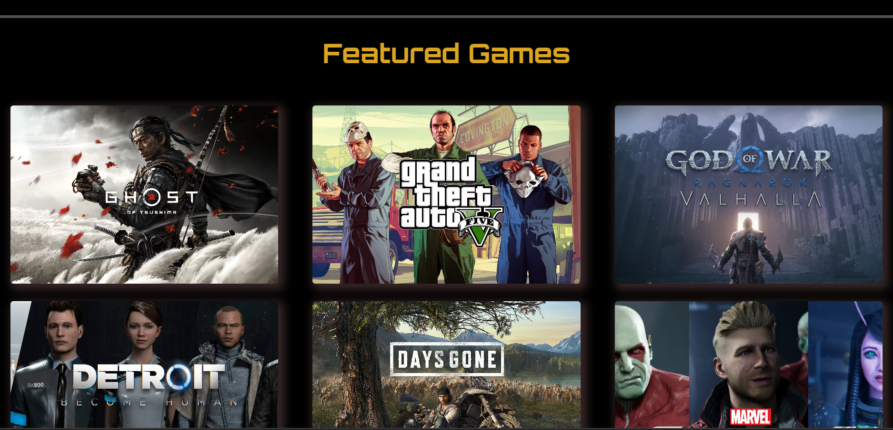
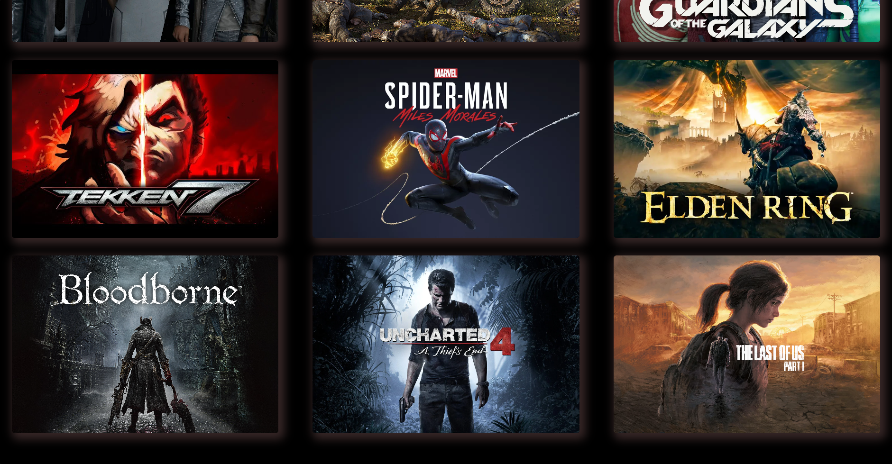
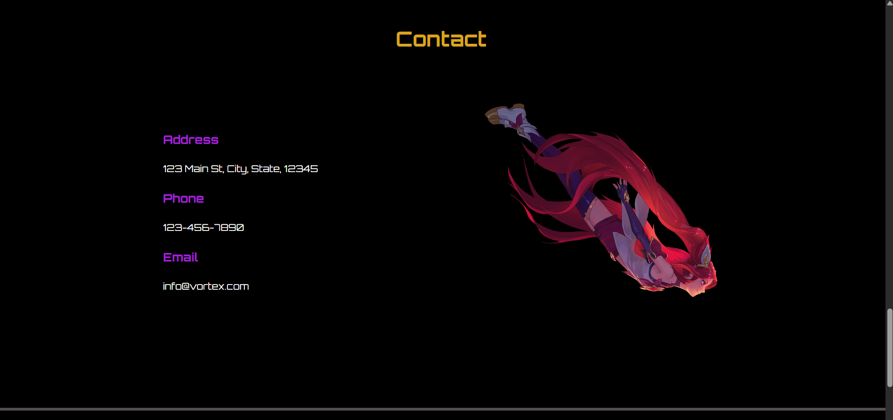
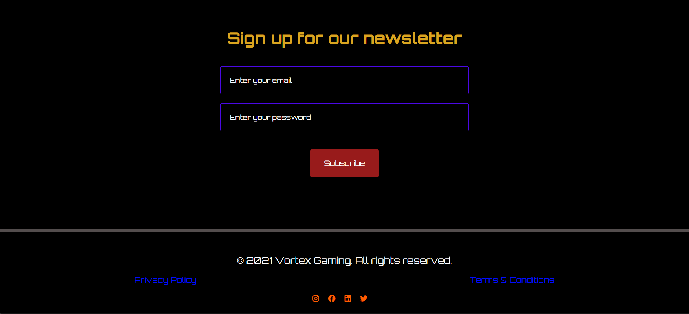

# Gaming Content Showcase - Vortex

This is a static gaming content website named **Vortex**, designed to showcase various games with a clean and engaging layout.

## Preview

<p align="center">
  
  
  
</p>
<p align="center">
  
  
  
</p>

## Features

- Eye-catching hero section with an introduction to the Vortex platform
- Sections for "About Vortex", featured games, contact details, and newsletter subscription
- Clean and visually engaging layout with beautiful imagery and dynamic elements

## Technologies Used

- HTML
- CSS
- FontAwesome for icons
- Google Fonts for the Orbitron typeface

## How to Run

1. Clone the repository:
   ```sh
   git clone https://github.com/yourusername/gaming-content-showcase.git
   ```
2. Open `index.html` in your browser.

## Important Notes

- **Not Responsive**: This website is not designed to be responsive. It may not display correctly on mobile devices or different screen sizes.
- **Educational Purposes Only**: This project was made for educational purposes to demonstrate basic web development techniques.

## Folder Structure

- **index.html**: Main HTML file containing the structure of the webpage.
- **style.css**: CSS file containing all the styles used in the webpage.
- **images/**: A folder containing images for the website, such as the hero section, featured game thumbnails, and other illustrations.
